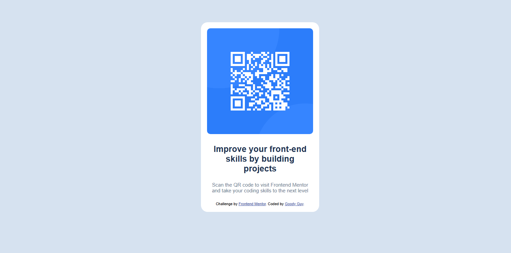

# Frontend Mentor - QR code component solution

This is a solution to the [QR code component challenge on Frontend Mentor](https://www.frontendmentor.io/challenges/qr-code-component-iux_sIO_H). Frontend Mentor challenges help you improve your coding skills by building realistic projects. 

## Table of contents

- [Overview](#overview)
  - [Screenshot](#screenshot)
  - [Links](#links)
- [My process](#my-process)
  - [Built with](#built-with)
  - [What I learned](#what-i-learned)
  - [Continued development](#continued-development)
  - [Useful resources](#useful-resources)
  - [AI Collaboration](#ai-collaboration)
- [Author](#author)
- [Acknowledgments](#acknowledgments)


## Overview

### Screenshot




### Links

- Solution URL: [https://github.com/Goodyguy-star/Goodyguy-star](https://github.com/Goodyguy-star/Goodyguy-star)
- Live Site URL: [https://goodyguy-star.github.io/Goodyguy-star](https://goodyguy-star.github.io/Goodyguy-star)

## My process

### Built with

- Semantic HTML5 markup
- CSS custom properties
- Flexbox

### What I learned

I learnt that using percentages is important in creating responsive design since it is an relative unit.

```html
<section class="card">......</section>
```
```css
body {
    background-color: hsl(212, 45%, 89%);
    font-family: 'Outfit', sans-serif;
    justify-content: center;
    align-items: center;
    min-height: 100vh;
}
```


### Continued development

I would love to dwell more in css design especially meeting WCAG requirements.


### Useful resources

- [Freecodecamp](https://freecodecamp.com) - This helped me for adjusting my content to different screen sizes, as I also do most of my projects in there.

### AI Collaboration

Describe how you used AI tools (if any) during this project. This helps demonstrate your ability to work effectively with AI assistants.

- I used ChatGPT.
- I used it in brainstorming problems and understand their solutions.
- Everything worked well except for the screen size adjustment.


## Author

- Website - [Nduchekwe Goodluck]
- Frontend Mentor - [@Goodyguy-star](https://www.frontendmentor.io/profile/Goodyguy-star)
- Twitter - [@GNduchekwe4544](https://x.com/GNduchekwe4544)


## Acknowledgments

Shout-out to Jerry, who sacrificed his time to help me in some of the problems I faced while creating this project.